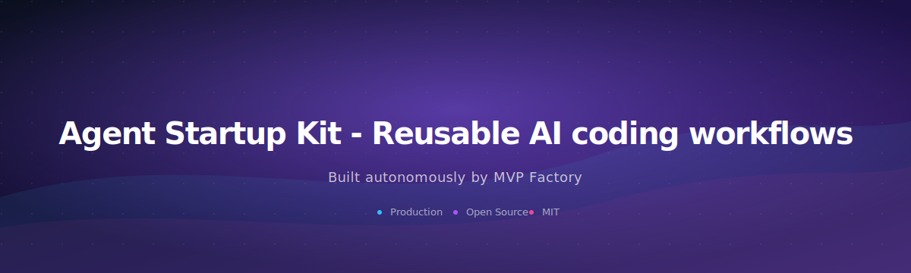
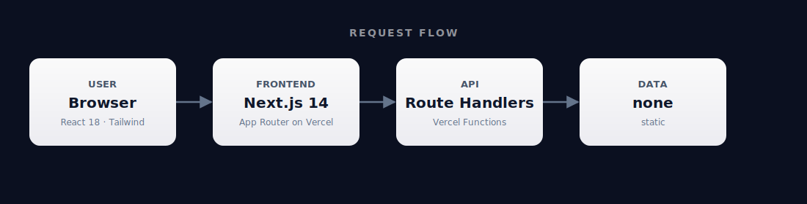

<div align="center">



# Agent Startup Kit - Reusable AI coding workflows

### Reusable AI coding workflows for Claude Code and VS Code to rapidly ship features like authentication. Framework for developers to leverage agent capabilities without reimplementing common patterns.

**Repo:** <https://github.com/malikmuhammadsaadshafiq-dev/agent-startup-kit-reusable-ai-366f>

      

</div>

---

## What is this?

Reusable AI coding workflows for Claude Code and VS Code to rapidly ship features like authentication. Framework for developers to leverage agent capabilities without reimplementing common patterns.

This repository was generated end-to-end by **[MVP Factory](https://github.com/malikmuhammadsaadshafiq-dev)** — eight specialized AI agents that research a real-world demand signal, design the system, write the code, test it, and ship it to Vercel.

## ✅ What works right now

- The frontend renders at **the deployed Vercel URL** as soon as Vercel finishes the first build.
- ⚠️ The code reads 7 env var(s): `AGENT_KIT_URL`, `BASE_URL`, `CI`, `DATABASE_URL`, `JWT_SECRET`, `NEXT_PUBLIC_URL`, `VERCEL`. These **must be set on the Vercel project** (_Settings → Environment Variables_) — otherwise the live URL will return 500 wherever those values are touched. See the *Environment variables* section below for where to obtain each.
- ℹ️ A local `backend/` directory exists in the repo but **is not deployed** — only `api/*.py` and the Next.js frontend ship to Vercel.

## Architecture

<div align="center">



</div>

| Layer | Technology | Where it runs |
|-------|------------|---------------|
| Frontend | Next.js 14 + Tailwind | Vercel Edge / CDN |
| Backend | Next.js Route Handlers (TypeScript) | Vercel Functions / Edge — each `route.ts` is a stateless handler |
| Storage | none | n/a |

Backend logic lives inside the same Next.js app as Route Handlers. They deploy as Vercel Functions and run server-side per request.

## 🚀 Quick start (5 minutes)

### Prerequisites

- **Node.js 18+** — verify with `node --version`
- **Git**

### 1. Clone

```bash
git clone https://github.com/malikmuhammadsaadshafiq-dev/agent-startup-kit-reusable-ai-366f
cd agent-startup-kit-reusable-ai-366f
```

### 2. Install

```bash
npm install
```

### 3. Configure environment

```bash
cp .env.local.example .env.local
```

Open `.env.local` and fill in the real values (see *Environment variables* below for where to get each one).

### 4. Run

```bash
npm run dev
```

Open <http://localhost:3000>.

## Environment variables

Set these locally in `.env.local` **and** on the Vercel project (Settings → Environment Variables). The repo ships with a fully-commented `.env.local.example` template — `cp .env.local.example .env.local` and fill it in.

| Variable | Where to get it |
|----------|-----------------|
| `AGENT_KIT_URL` | Connection / endpoint URL |
| `BASE_URL` | Connection / endpoint URL |
| `CI` | See the code for what this should be |
| `DATABASE_URL` | Vercel Postgres / Neon / Supabase connection string |
| `JWT_SECRET` | Generate: openssl rand -base64 32 |
| `NEXT_PUBLIC_URL` | Connection / endpoint URL |
| `VERCEL` | See the code for what this should be |

## 📦 Deploy your own copy

### Option A — One-click via Vercel (easiest)

[](https://vercel.com/new/clone?repository-url=https://github.com/malikmuhammadsaadshafiq-dev/agent-startup-kit-reusable-ai-366f)

1. Click the button (or open <https://vercel.com/new>) and import the repo.
2. On the Vercel import screen, paste the env vars listed under *Environment variables* above. Vercel will then build and serve the deployment.
3. Vercel auto-deploys on every push to `main` from then on.

### Option B — Vercel CLI

```bash
npm i -g vercel
git clone https://github.com/malikmuhammadsaadshafiq-dev/agent-startup-kit-reusable-ai-366f
cd agent-startup-kit-reusable-ai-366f
vercel link
# Push the env vars to Vercel (run once per var, paste the value when prompted):
vercel env add AGENT_KIT_URL
vercel env add BASE_URL
vercel env add CI
vercel env add DATABASE_URL
vercel env add JWT_SECRET
vercel env add NEXT_PUBLIC_URL
vercel env add VERCEL

vercel --prod
```

## 🏭 Going to production

- **Wire up real keys.** The deployed URL will surface 500s on any code path that touches an unset env var. Set every variable from the *Environment variables* table inside Vercel before sharing the link.
- **Custom domain.** Vercel project → Settings → Domains → Add. The `.vercel.app` URL works fine for testing but is rate-limited and not great for branding.
- **Analytics.** Vercel Web Analytics is one click away under the project's Analytics tab. Plausible / PostHog are also a 5-line snippet drop-in.

## Project structure

```
api/
  database.py
  index.py
  models.py
  requirements.txt
  routes/
  seed.py
  seed_data.py
backend/
  conftest.py
  pytest.ini
  requirements-test.txt
  test_workflows.py
cli/
  index.js
  package.json
frontend/
  package.json.test-deps
  playwright.config.ts
  tests/
next.config.js
package.json
postcss.config.js
src/
  app/
  components/
  lib/
tailwind.config.js
tsconfig.json
```

## API surface

**Next.js Route Handlers** (`src/app/**/route.ts`):

```
/api/workflows
/api/workflows/submit
```

## 🛠 Troubleshooting

| Issue | Fix |
|-------|-----|
| `'next' is not recognized` | You skipped step 2 — run `npm install`. |
| `Module not found` errors | Run `npm install` again, then delete `.next/` and retry. |
| Port 3000 already in use | `npx kill-port 3000`, or run with `PORT=3001 npm run dev`. |
| Live URL returns 500 on a real action | Env vars not set on Vercel. Project → Settings → Environment Variables → add the keys from the table above, then redeploy. |

## For AI agents reading this repo

- **Stack:** Next.js 14 frontend + Next.js Route Handlers (TypeScript)
- **Run locally:** `npm install && npm run dev` (port 3000)
- **Backend lives at:** `src/app/api/`
- **Backend runs as:** Vercel Functions / Edge — each `route.ts` is a stateless handler
- **No long-running server processes** — every request hits a fresh function instance.
- **Storage:** none
- **Required env vars:** `AGENT_KIT_URL`, `BASE_URL`, `CI`, `DATABASE_URL`, `JWT_SECRET`, `NEXT_PUBLIC_URL`, `VERCEL`

## License

MIT — generated autonomously by [MVP Factory](https://github.com/malikmuhammadsaadshafiq-dev).
